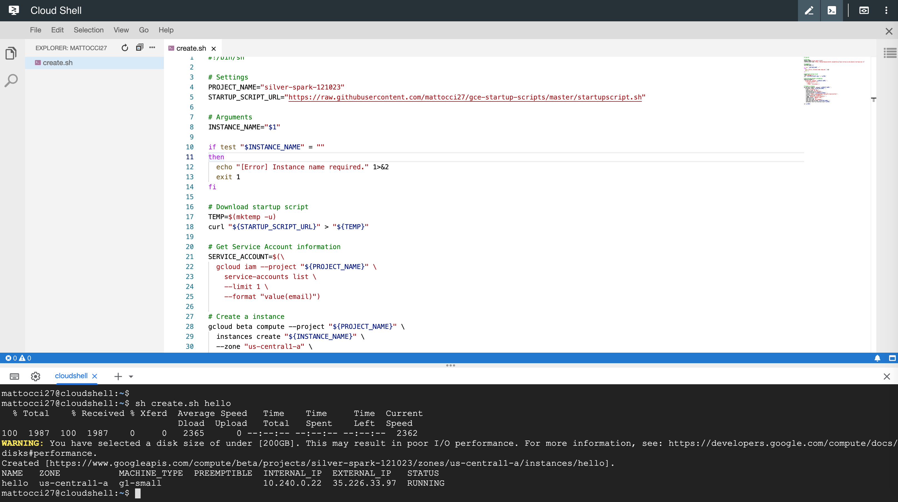

# Startup scripts for GCE

## Before running create.sh

- setup port 80 (HTTP) for Rstudio on GCE console
- setup ssh keys on GCE console

## Usage

```
sh create.sh instance-name
```

- use google cloud shell
- save create.sh in the cloud console
- for example, `sh create.sh hello` creates a hello instance.



## Startup script log

- CentOS and RHEL: `/var/log/messages`
- Debian: `/var/log/daemon.log`
- Ubuntu: `/var/log/syslog`
- SLES: `/var/log/messages`

## Related

- [Macに別れを告げて、クラウド中心の開発生活を始めるまで](https://qiita.com/cognitom/items/c489991a05f9abac748f)